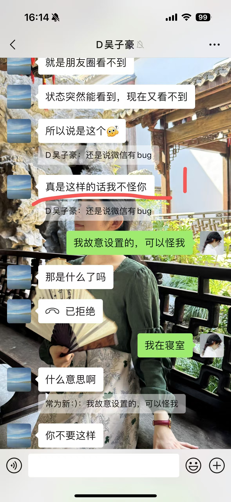

# 我的忏悔录

我的忏悔录

亲爱的刘旭冉：

&emsp;&emsp;可好？

&emsp;&emsp;我深刻反思并忏悔我存在的各种问题。

&emsp;&emsp;我首先反省那天晚上令人不适的言论。可见附件。

&emsp;&emsp;这件事情是我一手造成的，责任完全在我。在整件事情中，我引发并扩大了矛盾，煽风点火，最终导致了如今不可挽回的局面。经过我的冷静思考，我认为我的沟通非常低效，尤其是冲突情绪下的沟通。大多数时候，我的沟通呈现阴阳怪气、命令式等其他让人难受的形式。冷冰冰的文字会严重的伤害一个人的心。

&emsp;&emsp;这并非我想表达的本意。我说这句话并不是说我要推脱责任，而是承认我在沟通技巧方面存在极大的问题。当我们的共同目的出现危机时，我往往会和你发生争执，我会强迫你接受我的观点，把我的想法强行塞给你。简单点说，就是诉诸言语暴力。我本来是想要解决问题的，可是为什么会这样呢，究其根本，是因为我在情绪冲突下，我会不当地把解决问题的目的转化为战胜你，陷入到出现矛盾-言语暴力-让你失去安全感-矛盾升级的死循环中。这样的沟通不仅是无效的，无益于问题的解决，更会大大提高后续沟通的难度和成本。

&emsp;&emsp;其次，我反省我长期以来过于强势的命令口吻。我认真考虑我们应该是对等的关系。不是因为“我喜欢你”而肆无忌惮。可能这和第一点有重复，但我认为，言语只是过于强势的命令的表现形式之一，更多的是我自身对爱情的认识并不到位。我们对不同东西的认知是不一样的，我可以忽视的很多东西都是你不能完全忽视的，比如休息，比如学业，再比如你需要学习雅思。而我却长期忽视了你的需求，以自我为中心，使用命令式的口吻妄图解决问题。这样做终究是徒劳无功的。我们应该势均力敌相互欣赏。相互尊重是我们之间沟通交流的基础。这才是正确的沟通交往方式。

&emsp;&emsp;这些是长期以来悬而未决的问题。

&emsp;&emsp;我保证在之后的交流中

&emsp;&emsp;自分开以来，我已两宿夜不能寐。

&emsp;&emsp;行至此处，潸然泪下，不知所言。

写于2024.12.27 5:13-6:19

吴子豪

我的反思

&emsp;&emsp;在办公室里写反思怪不好意思的，大家都在研究各自的课题，我却在对着微信聊天记录一次
次品读。

&emsp;&emsp;细细读完之后，我深刻反思自己，我的言语沟通存在非常大的问题。发消息的时候自己一点
都没发觉，大概是那时候受到情绪的影响。但现在看看，都是些非常伤人心的话，我怎么都
想不明白自己为什么会说出这样的话。我在看了《关键对话》这本书之后，愈发觉得自己的
沟通技巧上有很大的问题。下面针对聊天记录一一分析。

1.  我的本意是给个台阶下
我认为这句话被理解为了反面的意思，就是
说如果是故意屏蔽的，我就要怪你。属于沟
通表达不当。
无论如何，我都不应该责怪你。

2.  你屏蔽我的时候不需要征求我的意见。
我当时的确因为被屏蔽而生气。但是如
果女生屏蔽我，大概率因为我说的话、
或者我做的事让她生气了。我当时就应
该认真反思下是否有做错的事。属于没
有换位思考。

3. 
4. 
5. 这三句让人感觉是威胁。我当时的想法
是想尽快把事情说明白，因为当时觉得
无故被屏蔽很委屈。但是这三句却火上
浇油。感觉我是在命令。属于表达不当
加言语情绪化。

6. 
7. 这两句是我当时想把事情说清楚。但是
给人一种命令之感。属于表达不当加言
语情绪化。

8. 这里补充一下说这句话的背景。是因为
直接退掉了买的蛋糕（截图可见后面）。
我直接说这句话感觉我在骂人。让对方
非常不舒服。无论如何不该这么说话。
属于表达不当加言语情绪化。

9. 
10. 这两句就是在指责你故意不回消息。在
你生气的时候，我应该表示理解和感同
身受，而不是一味的指责。属于没有思
考你的感受。

11. 
12. 这两句话是顺着你的话“没有给你选择
的权利”说的。但是你本没有要断绝关
系的想法的，说了这句话反而让你有了
这样的想法。我没有想要这样的意思，
说话时脑子非常糊涂。然后也让你觉得
我不值得。属于没有思考你的感受。

总结：我在被屏蔽的情况下非常生气，多次使用命令语气，说了远超原来本意的话，甚至要
求断绝关系，火上浇油，让你感到非常伤心失望。我对此非常后悔。请原谅我。

